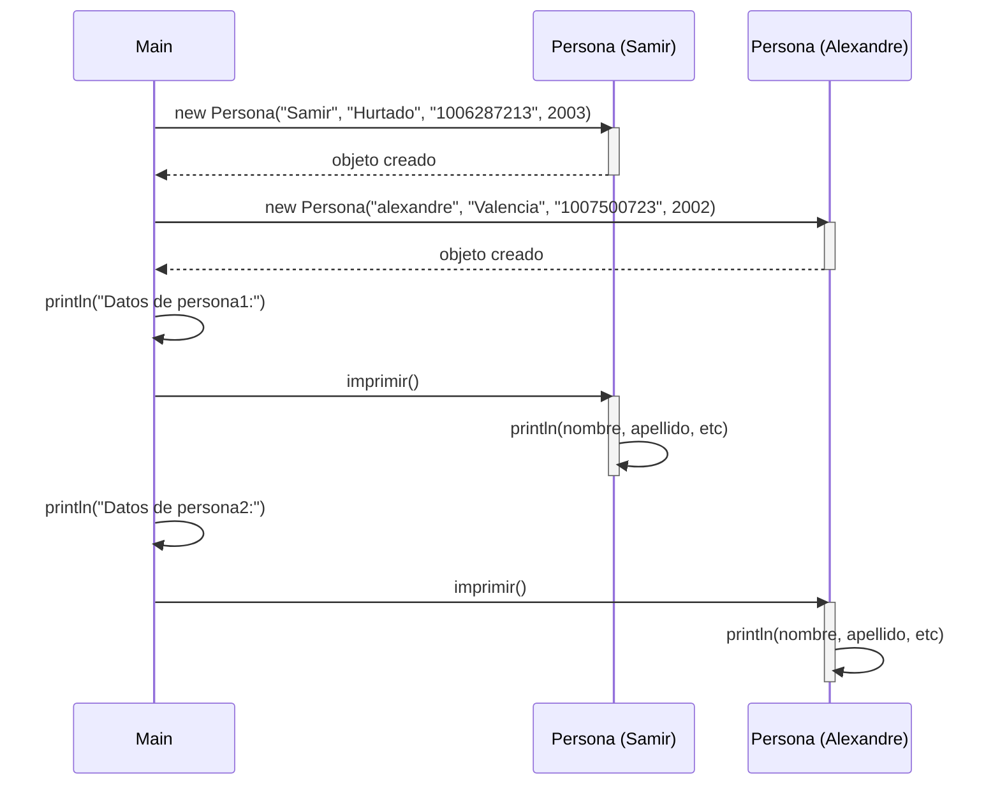

# Proyecto Demo412

## Descripción
Proyecto Java que implementa una clase `Persona` para gestionar información personal y un programa principal que demuestra su uso.

---

## Clase Persona

```java
package com.example412;

public class Persona {

    public String nombre;
    public String apellido;
    private int numeroDocumento;
    private int añoNacimiento;

    // Constructor
    public Persona(String nombre, String apellidos, String numeroDocumentoIdentidad, int anioNacimiento) {
        this.nombre = nombre;
        this.apellido = apellidos;
        this.numeroDocumento = Integer.parseInt(numeroDocumentoIdentidad);
        this.añoNacimiento = anioNacimiento;

    }

    // Método imprimir()
    public void imprimir() {
        System.out.println("Nombre: " + nombre);
        System.out.println("Apellidos: " + apellido);
        System.out.println("Número Documento: " + numeroDocumento);
        System.out.println("Año Nacimiento: " + añoNacimiento);
        System.out.println("----------------------------");
    }
}
```

### Atributos
- `nombre` (String): El nombre de la persona
- `apellido` (String): El apellido de la persona
- `numeroDocumento` (int): Número de documento de identidad
- `añoNacimiento` (int): Año de nacimiento

### Constructor
```java
Persona(String nombre, String apellidos, String numeroDocumentoIdentidad, int anioNacimiento)
```
Crea una nueva instancia de Persona con los datos proporcionados.

### Métodos
- `imprimir()`: Imprime en consola toda la información de la persona

---

## Clase Main

```java
package com.example412;

public class Main {
    public static void main(String[] args) {
         

        Persona persona1 = new Persona("Samir", "Hurtado", "1006287213", 2003);
        Persona persona2 = new Persona("alexandre", "Valencia", "1007500723", 2002);

        System.out.println("Datos de persona1:");
        persona1.imprimir();

        System.out.println("Datos de persona2:");
        persona2.imprimir();
    }
}
```

### Descripción
Programa principal que crea dos instancias de la clase `Persona` y muestra sus datos en consola.

### Ejemplo de Ejecución
```
Datos de persona1:
Nombre: Samir
Apellidos: Hurtado
Número Documento: 1006287213
Año Nacimiento: 2003
----------------------------
Datos de persona2:
Nombre: alexandre
Apellidos: Valencia
Número Documento: 1007500723
Año Nacimiento: 2002
----------------------------
```

---

## Diagramas UML

### Diagrama de Clases

```mermaid
classDiagram
    class Persona {
        +String nombre
        +String apellido
        -int numeroDocumento
        -int añoNacimiento
        +Persona(String, String, String, int)
        +imprimir() void
    }

    class Main {
        +{static} main(String[]) void
    }

    Main --> Persona : crea
```

### Diagrama de Secuencia - Ejecución del Programa



---

## Cómo Ejecutar

### Compilar
```bash
mvn clean compile
```

### Ejecutar
```bash
mvn exec:java -Dexec.mainClass="com.example412.Main"
```
